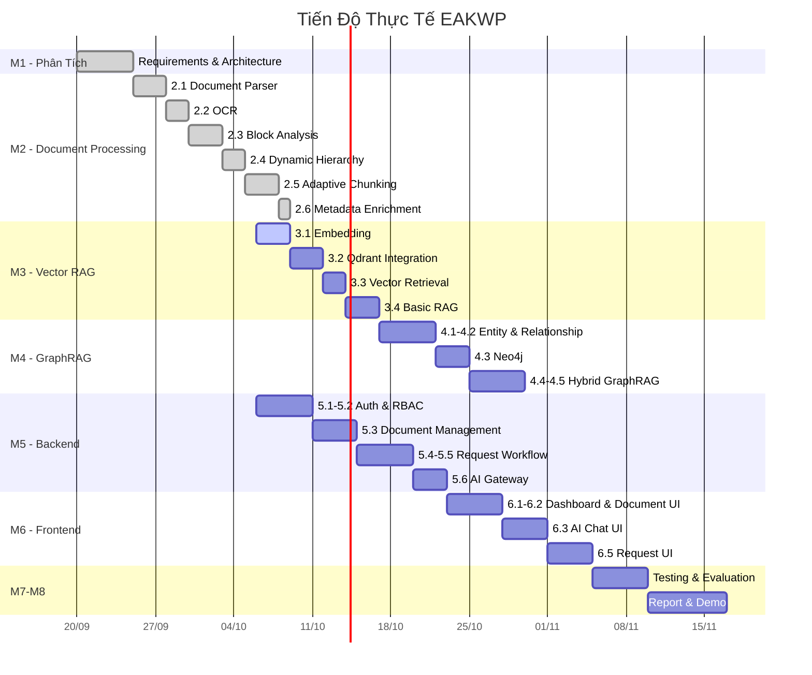
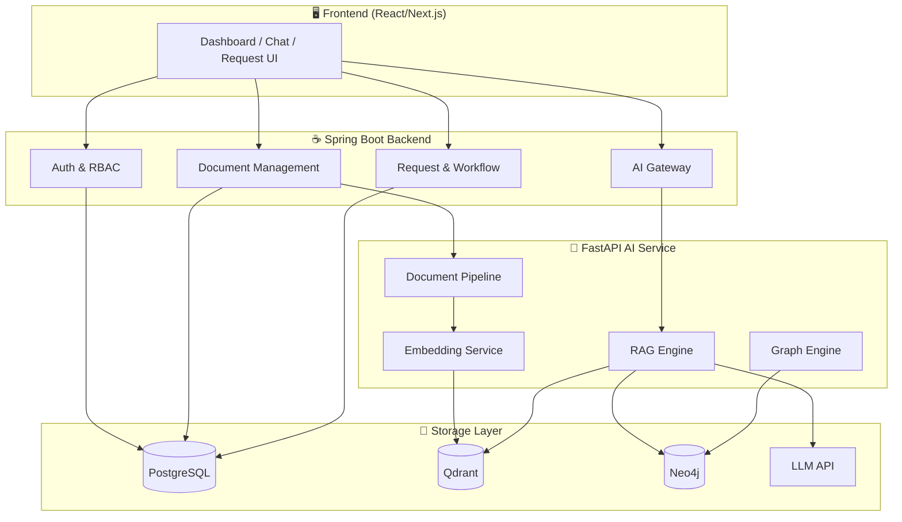
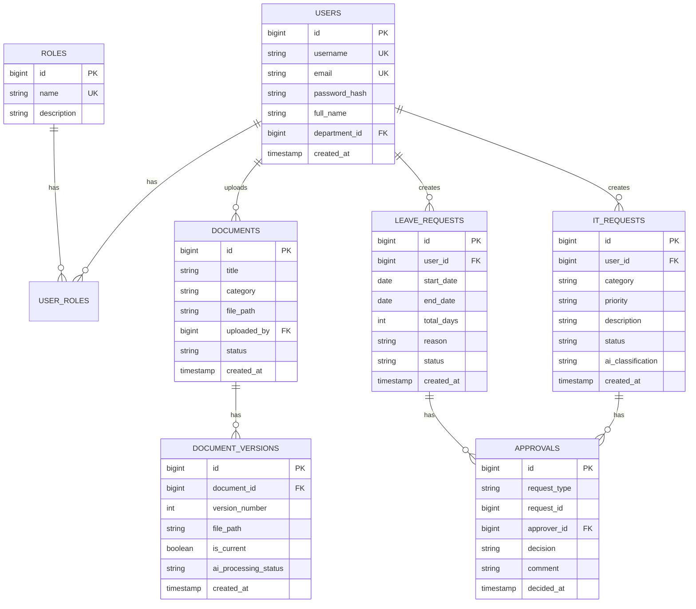
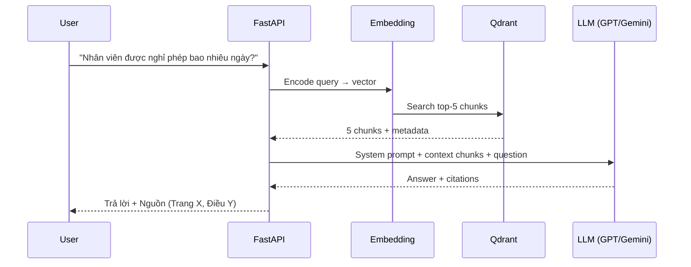
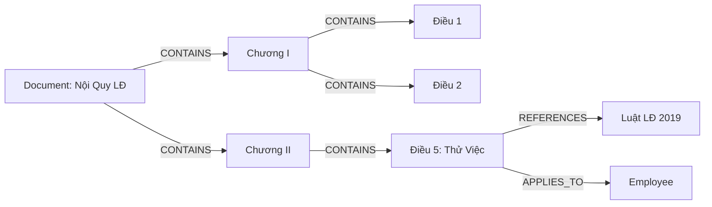
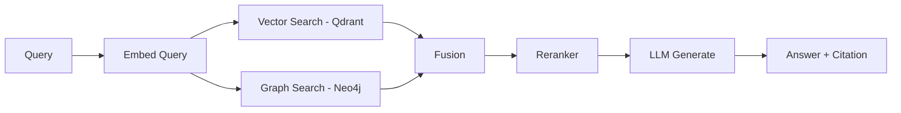
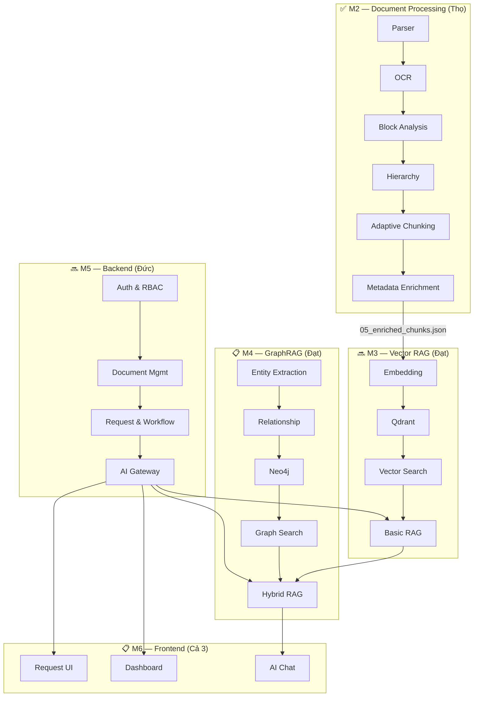

# 🏗️ EAKWP — MASTER PLAN & ĐÁNH GIÁ TOÀN DIỆN

> **Enterprise AI Knowledge & Workflow Platform**
> Nhóm: Thọ · Đạt · Đức

---

## PHẦN I — ĐÁNH GIÁ BẢN KẾ HOẠCH

### ✅ Những điểm XUẤT SẮC

| # | Điểm mạnh | Lý do quan trọng |
|---|-----------|-------------------|
| 1 | **Phân Module rõ ràng (M1→M8)** | Tránh tình trạng "ai cũng code lung tung, không ai biết hệ thống hoạt động ra sao". Mỗi Module có đầu vào, đầu ra, owner rõ ràng. |
| 2 | **Owner / Reviewer / Tester xoay vòng** | Đảm bảo mỗi thành viên hiểu toàn bộ hệ thống, không chỉ phần mình code. Hội đồng chấm thi rất thích điểm này. |
| 3 | **Output cụ thể cho mỗi Module** | Không mơ hồ "làm xong M2 là xong". Phải có JSON chuẩn, demo được, test được. |
| 4 | **Tách biệt AI Pipeline và Business Workflow** | Đúng chuẩn kiến trúc Enterprise: AI Service (FastAPI) không đụng vào nghiệp vụ, Backend (Spring Boot) không đụng vào AI. |
| 5 | **Hybrid GraphRAG là điểm nhấn đồ án** | Phần lớn đồ án chỉ làm Naive RAG (nhúng vector → search). Nhóm bạn có thêm Knowledge Graph + Reranker → vượt trội. |
| 6 | **Branching Strategy chuẩn** | `feature/tho/...`, `feature/dat/...`, `feature/duc/...` → PR → Review → Merge. Đúng quy trình công ty thực tế. |

### ⚠️ Những điểm CẦN BỔ SUNG / CHỈNH SỬA

| # | Vấn đề | Mức độ | Đề xuất |
|---|--------|--------|---------|
| 1 | **Thiếu Timeline cụ thể** | 🔴 Nghiêm trọng | Có Module nhưng không có ngày bắt đầu / kết thúc → dễ trôi deadline. Cần Gantt Chart. |
| 2 | **M4 (GraphRAG) quá nặng** | 🟡 Cảnh báo | Entity Extraction + Relationship Extraction + Neo4j + Graph Retrieval + Hybrid Search + Reranker = 6 module con phức tạp. Nên đánh dấu M4.4–M4.5 là "Nice-to-have", đảm bảo M3 (Vector RAG) hoạt động hoàn hảo trước. |
| 3 | **Thiếu phần Deployment** | 🟡 Cảnh báo | Kế hoạch chưa đề cập cách deploy (Docker Compose? VPS? Cloud?). Hội đồng sẽ hỏi. |
| 4 | **M1 Output chưa có người thực hiện** | 🟡 Cảnh báo | "☑ Architecture", "☑ Database ERD" nhưng ai vẽ? Dùng công cụ gì? Cần giao cụ thể. |
| 5 | **Thiếu Risk Management** | 🟢 Nhẹ | Nếu Đạt bận → M3/M4 bị chặn. Nếu Đức bận → M5 bị chặn. Cần plan B. |
| 6 | **File `documents/project_overview.md` bị duplicate** | 🟢 Nhẹ | Hiện có cả ở root `documents/` và `ai-service/docs/thesis/`. Cần xóa bản thừa. |

### 📊 Tiến độ thực tế so với kế hoạch



---

## PHẦN II — MASTER PLAN CHI TIẾT

---

### M1 — PHÂN TÍCH YÊU CẦU & THIẾT KẾ

> **Trạng thái: ✅ Cơ bản hoàn thành** (cần bổ sung ERD + Deployment Diagram)

#### M1.1 — Phân tích nghiệp vụ

| Actor | Use Case chính |
|-------|---------------|
| **Employee** | Xem tài liệu, Hỏi AI, Tạo đơn nghỉ phép, Tạo yêu cầu IT |
| **Manager** | Duyệt đơn nghỉ phép, Xem báo cáo, Hỏi AI |
| **Admin** | Upload tài liệu, Quản lý phiên bản, Quản lý user/role |
| **IT Support** | Xử lý yêu cầu IT, Cập nhật trạng thái |
| **AI Assistant** | Trả lời câu hỏi (RAG), Phân loại yêu cầu, Đề xuất xử lý |

#### M1.2 — Kiến trúc hệ thống



#### M1.3 — Database Design (PostgreSQL)



#### M1.4 — GitHub Strategy

| Nhánh | Mục đích |
|-------|---------|
| `main` | Production — chỉ merge từ `develop` khi demo/nộp |
| `develop` | Tích hợp — merge các feature đã review |
| `feature/tho/...` | Thọ: Document Processing, AI Pipeline |
| `feature/dat/...` | Đạt: Embedding, RAG, GraphRAG |
| `feature/duc/...` | Đức: Backend, Workflow, Frontend |

---

### M2 — DOCUMENT PROCESSING ✅ HOÀN THÀNH

> **Owner: Thọ** · Reviewer: Đạt · Tester: Đức

#### Trạng thái hiện tại

| Module | File | Trạng thái |
|--------|------|-----------|
| 2.1 Document Parser | [`app/document_parser.py`](file:///c:/enterprise-ai-platform/ai-service/app/document_parser.py) | ✅ Done |
| 2.2 OCR | Tích hợp trong `document_parser.py` | ✅ Done |
| 2.3 Block Analysis | [`app/block_analyzer.py`](file:///c:/enterprise-ai-platform/ai-service/app/block_analyzer.py) | ✅ Done |
| 2.4 Dynamic Hierarchy | [`app/structure_analyzer.py`](file:///c:/enterprise-ai-platform/ai-service/app/structure_analyzer.py) | ✅ Done |
| 2.5 Adaptive Chunking | [`app/adaptive_chunker.py`](file:///c:/enterprise-ai-platform/ai-service/app/adaptive_chunker.py) | ✅ Done |
| 2.6 Metadata Enrichment | [`app/metadata_enricher.py`](file:///c:/enterprise-ai-platform/ai-service/app/metadata_enricher.py) | ✅ Done |

#### Pipeline đã kiểm chứng trên 2 loại tài liệu khác nhau:
- Nội Quy Lao Động (15 trang)
- Điều Lệ Công Ty 2021 (38 trang) → 140 chunks

#### Scripts chạy từng bước:

| Script | Đầu vào | Đầu ra |
|--------|---------|--------|
| [`scripts/01_run_extractor.py`](file:///c:/enterprise-ai-platform/ai-service/scripts/01_run_extractor.py) | PDF | `debug/01_extracted_pages.json` |
| [`scripts/02_run_analyzer.py`](file:///c:/enterprise-ai-platform/ai-service/scripts/02_run_analyzer.py) | `01_...` | `debug/02_analyzed_nodes.json` |
| [`scripts/03_run_structure.py`](file:///c:/enterprise-ai-platform/ai-service/scripts/03_run_structure.py) | `02_...` | `debug/03_structured_nodes.json` |
| [`scripts/04_run_chunker.py`](file:///c:/enterprise-ai-platform/ai-service/scripts/04_run_chunker.py) | `03_...` | `debug/04_extracted_chunks.json` |
| [`scripts/05_run_metadata_enrichment.py`](file:///c:/enterprise-ai-platform/ai-service/scripts/05_run_metadata_enrichment.py) | `04_...` | `debug/05_enriched_chunks.json` |

---

### M3 — EMBEDDING & VECTOR RAG 🔜 TIẾP THEO

> **Owner: Đạt** · Reviewer: Thọ · Tester: Đức

#### M3.1 — Embedding Service

| Hạng mục | Chi tiết |
|----------|---------|
| **Model** | `sentence-transformers/paraphrase-multilingual-MiniLM-L12-v2` (hỗ trợ tiếng Việt, 384 dims) |
| **Input** | `05_enriched_chunks.json` |
| **Output** | Vector 384 chiều cho mỗi chunk |
| **File cần tạo** | `app/embedding_service.py` |

```python
# Pseudo-code M3.1
class EmbeddingService:
    def __init__(self, model_name):
        self.model = SentenceTransformer(model_name)

    def embed_chunks(self, chunks: List[Dict]) -> List[Dict]:
        texts = [c["content"] for c in chunks]
        vectors = self.model.encode(texts, batch_size=32)
        for chunk, vector in zip(chunks, vectors):
            chunk["vector"] = vector.tolist()
        return chunks
```

#### M3.2 — Qdrant Integration

| Hạng mục | Chi tiết |
|----------|---------|
| **Collection** | `enterprise_documents` |
| **Vector size** | 384 |
| **Distance** | Cosine |
| **Payload** | Toàn bộ metadata từ M2.6 |
| **File cần tạo** | `app/qdrant_service.py` |
| **Docker** | Đã có trong [`docker-compose.yml`](file:///c:/enterprise-ai-platform/docker-compose.yml) — port 6333 |

#### M3.3 — Vector Retrieval

```python
# Pseudo-code M3.3
class VectorRetriever:
    def search(self, query: str, top_k: int = 5, filters: dict = None):
        query_vector = self.embedding.encode(query)
        results = self.qdrant.search(
            collection="enterprise_documents",
            query_vector=query_vector,
            limit=top_k,
            query_filter=filters  # version_id, document_type, access_level
        )
        return results
```

#### M3.4 — Basic RAG



#### M3 Output cần đạt
- [ ] Upload PDF → Pipeline M2 chạy → Chunks vào Qdrant
- [ ] Hỏi câu hỏi → AI trả lời chính xác + trích dẫn nguồn
- [ ] Filter theo `document_type`, `version_id`

---

### M4 — KNOWLEDGE GRAPH & GRAPHRAG

> **Owner: Đạt** · Reviewer: Thọ · Tester: Đức

#### M4.1–M4.2 — Entity & Relationship Extraction

| Hạng mục | Chi tiết |
|----------|---------|
| **Phương pháp** | Rule-based (regex/pattern) + LLM hỗ trợ |
| **Entity types** | Document, Chapter, Article, Clause, Department, Role, Policy |
| **Relationship types** | `CONTAINS`, `REFERENCES`, `APPLIES_TO`, `BELONGS_TO` |

#### M4.3 — Neo4j



#### M4.5 — Hybrid GraphRAG Pipeline



> [!IMPORTANT]
> M4.4–M4.5 (Hybrid GraphRAG) nên được đánh dấu là **Nice-to-have**. Nếu thời gian hạn chế, ưu tiên hoàn thiện M3 (Vector RAG) trước. Vector RAG đã đủ để demo cho hội đồng. GraphRAG là điểm cộng lớn nhưng không phải bắt buộc.

---

### M5 — BACKEND & BUSINESS WORKFLOW

> **Owner: Đức** · Reviewer: Thọ · Tester: Đạt

#### Trạng thái hiện tại

| Module | Trạng thái |
|--------|-----------|
| Spring Boot skeleton | ✅ Done |
| User entity + CRUD | ✅ Done |
| JWT Authentication | ✅ Done |
| Security Config | ✅ Done |
| RBAC / Role management | 🔜 TODO |
| Document Management | 🔜 TODO |
| Leave Request | 🔜 TODO |
| IT Request | 🔜 TODO |
| AI Gateway | 🔜 TODO |

#### M5.6 — AI Gateway API Contract

| Endpoint | Method | Mô tả |
|----------|--------|-------|
| `/api/ai/chat` | POST | Gửi câu hỏi → RAG trả lời |
| `/api/ai/search` | POST | Tìm kiếm semantic |
| `/api/ai/process` | POST | Trigger pipeline xử lý tài liệu |
| `/api/ai/status/{id}` | GET | Kiểm tra tiến độ xử lý |

Spring Boot gọi sang FastAPI:
```
Spring Boot → HTTP POST → http://localhost:8000/api/v1/chat
                        → http://localhost:8000/api/v1/search
                        → http://localhost:8000/api/v1/process
```

---

### M6 — FRONTEND & SYSTEM INTEGRATION

> **Phân công theo màn hình**

| Màn hình | Owner | Mô tả |
|----------|-------|-------|
| Dashboard | Đức | Tổng quan: tài liệu, yêu cầu, AI usage |
| Document List/Detail | Thọ | Upload, xem phiên bản, xem source |
| AI Chat | Thọ + Đạt | Hỏi đáp + hiển thị nguồn trích dẫn |
| Request Management | Đức | Tạo đơn, duyệt đơn, lịch sử |
| Graph Visualization | Đạt | Optional — hiển thị Knowledge Graph |

---

### M7 — TÍCH HỢP & ĐÁNH GIÁ TOÀN HỆ THỐNG

*(Lưu ý: Unit test và Functional test được thực hiện liên tục trong từng Module M2 → M6. M7 chỉ tập trung vào đánh giá end-to-end).*

| Loại test | Owner | Nội dung |
|-----------|-------|---------|
| Integration Test | Cả 3 | Upload → Process → Embed → Search → Answer → UI |
| Performance Test | Đức | Thời gian phản hồi, tải của Qdrant/Neo4j |
| Security Test | Đức | Kiểm tra lỗ hổng RBAC, JWT token expiration |
| System Evaluation | Đạt + Thọ | Đánh giá tổng thể RAG pipeline vs Human baseline |

---

### M8 — BÁO CÁO & DEMO

| Chương | Owner | Trạng thái |
|--------|-------|-----------|
| Mở đầu | Cả 3 | 🔜 |
| Chương 01 — Tổng quan về Bài toán và Hệ thống | Đức | ✅ Draft ([`chapter_01_introduction.md`](file:///c:/enterprise-ai-platform/ai-service/docs/thesis/chapter_01_introduction.md)) |
| Chương 02 — Kỹ thuật AI/DL và Thực nghiệm | Đạt | 🔜 |
| Chương 03 — Knowledge Graph và RAG | Thọ | ✅ Done ([`chapter_03_document_processing_pipeline.md`](file:///c:/enterprise-ai-platform/ai-service/docs/thesis/chapter_03_document_processing_pipeline.md)) |
| Chương 04 — Thiết kế Hệ thống và Pipeline | Đức | 🔜 |
| Chương 05 — Triển khai, Kiểm thử và Kết quả | Cả 3 | 🔜 |

---

## PHẦN III — PHÂN CÔNG OWNER / REVIEWER / TESTER

| Giai đoạn | Owner | Reviewer | Tester |
|-----------|-------|----------|--------|
| **M1** Phân tích | Cả 3 | Cả 3 | Cả 3 |
| **M2** Doc Processing | **Thọ** | Đạt | Đức |
| **M3** Vector RAG | **Đạt** | Thọ | Đức |
| **M4** GraphRAG | **Đạt** | Thọ | Đức |
| **M5** Backend | **Đức** | Thọ | Đạt |
| **M6** Frontend | **Đức** | Đạt | Thọ |
| **M7** Testing | Cả 3 | Cả 3 | Cả 3 |
| **M8** Báo cáo | Cả 3 | Cả 3 | Cả 3 |

---

## PHẦN IV — BẢN ĐỒ TỔNG THỂ



---

## PHẦN V — CHECKLIST TỔNG THỂ

### M1 Output
- [x] Requirement Analysis
- [x] Use Case Diagram
- [x] Architecture Diagram
- [ ] Database ERD (Đức cần hoàn thiện trên PostgreSQL)
- [x] AI Pipeline Diagram
- [ ] Deployment Diagram
- [x] GitHub Project & Branching

### M2 Output
- [x] PDF → Parser → OCR → Blocks → Hierarchy → Chunks → Metadata → JSON
- [x] Kiểm chứng trên 2 loại tài liệu khác nhau
- [x] Scripts chạy từng bước độc lập
- [x] Chương 03 Báo cáo hoàn chỉnh

### M3 Output (Cần đạt)
- [ ] Embedding Service hoạt động
- [ ] Qdrant Collection được tạo và nạp dữ liệu
- [ ] Vector Search trả về kết quả chính xác
- [ ] Basic RAG: Hỏi → Trả lời + Citation

### M4 Output (Cần đạt)
- [ ] Entity & Relationship Extraction
- [ ] Neo4j lưu trữ Knowledge Graph
- [ ] Hybrid Search (Vector + Graph)
- [ ] Reranker

### M5 Output (Cần đạt)
- [ ] RBAC hoàn chỉnh
- [ ] Document CRUD + Version
- [ ] Leave Request Workflow
- [ ] IT Request Workflow
- [ ] AI Gateway kết nối FastAPI

### M6 Output (Cần đạt)
- [ ] Dashboard
- [ ] AI Chat với Citation
- [ ] Request Management UI

### M7 Output (Cần đạt)
- [ ] Test Cases & Results
- [ ] AI Evaluation Metrics
- [ ] Performance Report

### M8 Output (Cần đạt)
- [ ] Báo cáo hoàn chỉnh (7 chương)
- [ ] Video Demo
- [ ] Slide Thuyết Trình
