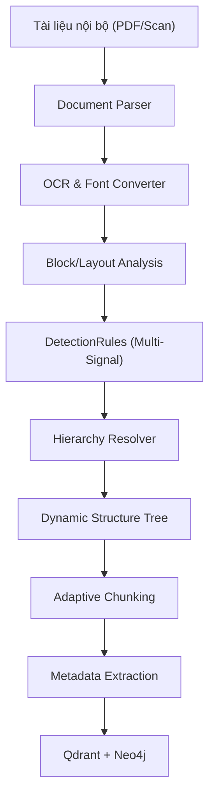

# Tổng quan dự án

**Tên đề tài:** Hệ thống quản lý tri thức doanh nghiệp và xử lý yêu cầu nghiệp vụ ứng dụng RAG và AI tạo sinh

Đây là nền tảng quản trị tri thức nội bộ (Enterprise Knowledge Base) dành cho doanh nghiệp, kết hợp khả năng xử lý nghiệp vụ tự động dựa trên sức mạnh của LLM, Vector Search và Knowledge Graph.

---

## 1. Tác dụng cốt lõi của hệ thống

Hệ thống tập trung giải quyết các điểm nghẽn trong vận hành doanh nghiệp truyền thống:

1. **Giảm thiểu thời gian tìm kiếm:** Thay vì quy trình thủ công (Mở thư mục ➡️ Tìm file ➡️ Ctrl+F ➡️ Đọc nhiều trang), nhân viên chỉ cần đặt câu hỏi bằng ngôn ngữ tự nhiên (VD: *"Nhân viên được nghỉ phép bao nhiêu ngày mỗi năm?"*), AI sẽ tự động tìm và trả về đáp án chính xác.
2. **Biến tài liệu thô thành Kho tri thức:** Số hóa, phân tích và cấu trúc hóa toàn bộ văn bản nội bộ (Quy chế, Quy định, Hướng dẫn, Chính sách) vào hệ thống Hybrid GraphRAG.
3. **Giảm tải cho bộ phận HR/IT:** AI đóng vai trò như một trợ lý 24/7, giải đáp trực tiếp các thắc mắc lặp đi lặp lại về quy trình, điều kiện, chính sách.
4. **Hỗ trợ xử lý yêu cầu nghiệp vụ:** Không dừng lại ở hỏi đáp (Q&A), AI còn tham gia vào luồng công việc (Workflow) như hướng dẫn, tiếp nhận, và đề xuất xử lý các yêu cầu xin nghỉ phép, yêu cầu hỗ trợ IT. (Quyết định cuối cùng vẫn thuộc về cấp thẩm quyền).

---

## 2. Các nhóm nghiệp vụ chính

Hệ thống được chia thành 2 phân hệ lớn:

```text
HỆ THỐNG
│
├── 1. Quản lý & Khai thác tri thức (Knowledge Base & Q&A)
│
└── 2. Quản lý & Xử lý yêu cầu nghiệp vụ (Business Operations)
      ├── Xin nghỉ phép (Leave Request)
      └── Hỗ trợ IT (IT Support)
```

---

## 3. Kiến trúc tổng thể: Hybrid GraphRAG

Dự án không sử dụng phương pháp Naive RAG (nhúng vector đơn thuần) mà áp dụng kiến trúc **Hybrid GraphRAG** tiên tiến, kết hợp giữa tìm kiếm ngữ nghĩa và tìm kiếm đồ thị quan hệ.

1. **Qdrant (Vector Search):** Xử lý tìm kiếm ngữ nghĩa (Semantic). Ví dụ: Hiểu câu hỏi *"Tôi được nghỉ phép bao nhiêu ngày?"* tương đồng với câu văn *"Người lao động được hưởng 12 ngày nghỉ phép..."*.
2. **Neo4j (Graph Search):** Truy xuất dựa trên cấu trúc và mối quan hệ thực thể (Quy chế ➡️ Chương ➡️ Điều ➡️ Khoản). 

Kiến trúc này định hướng mở rộng sang **Knowledge Graph ➡️ Community Detection ➡️ Global Search**, giúp hệ thống tổng hợp trả lời cho các câu hỏi mang tính vĩ mô toàn cục.

---

## 4. Smart Document Pipeline (Luồng xử lý tài liệu thông minh)

Để biến tài liệu thô thành kho tri thức cấu trúc cao, hệ thống sử dụng một Pipeline nâng cao:



---

## 5. Điểm đột phá công nghệ: Dynamic Structure-Aware System

Khác biệt hoàn toàn với các hệ thống RAG cơ bản (cắt văn bản máy móc mỗi 1000 ký tự), dự án áp dụng kiến trúc **Hệ thống Nhận thức Cấu trúc Động**, được thiết kế để xử lý sự phức tạp và nhiễu của tài liệu doanh nghiệp thực tế.

### 5.1. Dynamic Multi-Level Hierarchy (Phân cấp đa tầng động)
Hệ thống không "hardcode" cố định các cấp (như `L1 = Chapter`, `L2 = Article`). Thay vào đó, hệ thống sử dụng **Depth (độ sâu tương đối)** để xử lý mọi định dạng tài liệu:
- **Tài liệu Quy chế:** `CHƯƠNG I (Depth 0)` ➡️ `Điều 1 (Depth 1)` ➡️ `Khoản 1 (Depth 2)` ➡️ `a) (Depth 3)`.
- **Tài liệu Quy trình:** `I. Tổng quan (Depth 0)` ➡️ `1. Mục đích (Depth 1)` ➡️ `1.1. Phạm vi (Depth 2)`.

Hệ thống duy trì một mảng trạng thái `current_path`. Khi đi sâu vào cấu trúc thì thêm Node mới, khi quay lại cấp cao hơn thì tự động xóa các cấp phía dưới.

### 5.2. Multi-Signal Detection (Nhận diện đa tín hiệu)
Để phân biệt chính xác một tiêu đề (Heading) với một đoạn văn bình thường (Ví dụ: Heading `"1. Mục đích"` vs Danh sách `"1. Người lao động phải..."`), hệ thống tổng hợp đa tín hiệu để chấm điểm **Confidence Score**:
- **Text Pattern:** Regex, Numbering.
- **Layout Signal:** Kích thước chữ (Font size), In đậm (Bold), Indentation (Thụt lề).
- **Heuristics:** Độ dài câu (Câu tiêu đề thường ngắn), Viết hoa toàn bộ.
- **Contextual Signal:** Ngữ cảnh cấu trúc Node trước đó.

### 5.3. OCR Resilience (Khả năng chống chịu lỗi OCR)
Tài liệu scan (đặc biệt tại Việt Nam) thường bị lỗi bảng mã hoặc nhận diện sai. Hệ thống được thiết kế để "sống sót" qua nhiễu OCR:
- Tích hợp `font_converter` xử lý lỗi bảng mã cổ điển (VNI, TCVN3).
- Sử dụng **Fuzzy Matching / Regex mờ** thay vì Regex cứng ngắc để khoan dung lỗi (VD: OCR ra `Cttương`, `ĐIều`).
- Nếu OCR mất thông tin Layout (Font size, Bold), hệ thống tự động tăng trọng số của các tín hiệu Context và Heuristics để giữ vững cấu trúc Cây (Tree).

### 5.4. Advanced Block Typings (Phân loại Block chi tiết)
Nâng cấp từ mô hình phân loại thô (`Structured/Unstructured`) sang kiến trúc phân loại cấu trúc chuẩn xác:
- **`HEADING`**: Bao gồm PART, CHAPTER, ARTICLE, SECTION, NUMBERED, GENERIC.
- **`PARAGRAPH`**: Đoạn văn bản nội dung.
- **`LIST`**: NUMBERED_LIST (Danh sách đếm số), BULLET_LIST (Dấu +, -).
- **`TABLE`**: Bảng biểu (Đi qua Pipeline trích xuất riêng biệt để giữ định dạng dòng/cột).

### 5.5. Truy xuất nguồn gốc chính xác (Traceability & Citation)
Nhờ xây dựng được cây cấu trúc vững chắc, mọi câu trả lời của AI đều được cấp tọa độ chi tiết đến từng ngách nhỏ nhất của văn bản:
👉 *Quy chế nhân sự ➡️ Version 2026 ➡️ Chương II ➡️ Điều 5 ➡️ Khoản 2 ➡️ Chunk content.*
