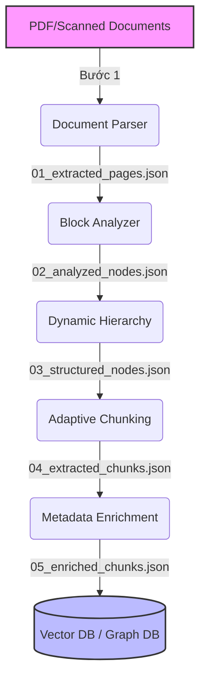
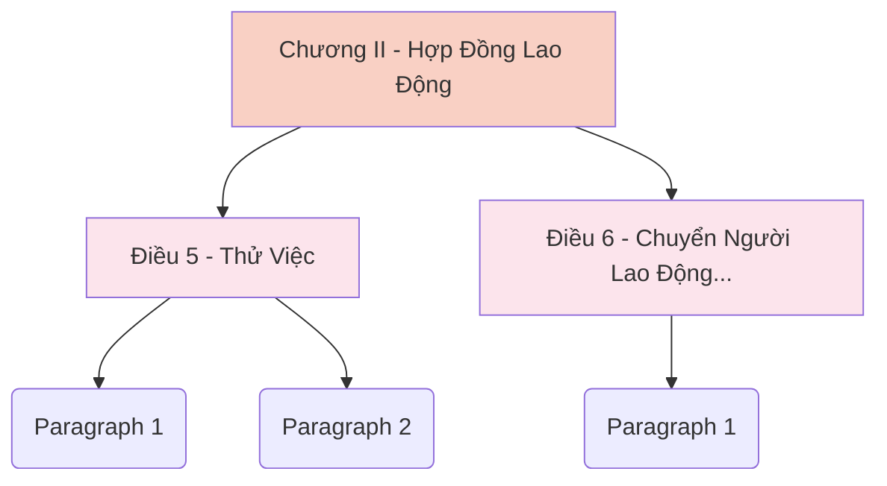
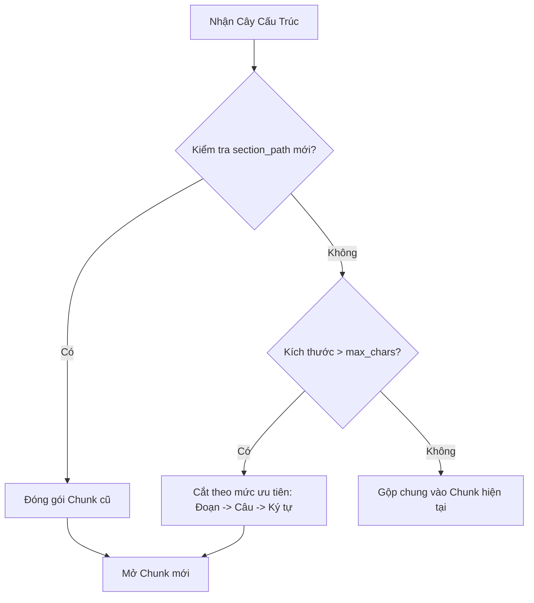

# CHƯƠNG 03: XỬ LÝ TÀI LIỆU VÀ XÂY DỰNG DỮ LIỆU CHO RAG

Chương này trình bày chi tiết về quá trình xây dựng một Pipeline xử lý tài liệu chuẩn Doanh nghiệp (Enterprise-grade). Thay vì sử dụng các phương pháp bóc tách nguyên khối (Monolithic), hệ thống được thiết kế theo kiến trúc Module hóa (Modular Architecture) 5 bước độc lập. Qua đó, giải quyết triệt để các thách thức về nhận diện ranh giới ngữ nghĩa (Section Boundary), nhiễu OCR (Garbage) và đảm bảo chất lượng siêu dữ liệu (Metadata) trước khi nhúng vào Vector Database.

## 3.1. Tổng quan pipeline xử lý tài liệu

Hệ thống xử lý tài liệu được chia thành 5 công đoạn tuyến tính, hoạt động độc lập và giao tiếp với nhau thông qua cấu trúc dữ liệu JSON trung gian. Kiến trúc này mang lại khả năng truy vết (Traceability) và bảo toàn dữ liệu (Lossless Pipeline) ở mức tối đa.



## 3.2. Document Parser

Nhiệm vụ đầu tiên là trích xuất dữ liệu thô từ các định dạng tài liệu đầu vào (chủ yếu là PDF).

### 3.2.1. Trích xuất nội dung PDF & 3.2.2. Trích xuất thông tin trang
Sử dụng các thư viện chuyên dụng như `PyMuPDF` để quét và bóc tách văn bản. Parser duyệt qua từng trang (Page) và gắn nhãn `page_number` ngay từ đầu để phục vụ tính năng Trích dẫn (Citation) sau này.

**Dẫn chứng code (`app/document_parser.py`):**
```python
def extract_text(self, file_path: str) -> List[Dict[str, Any]]:
    doc = pymupdf.open(file_path)
    pages_data = []
    
    for page_num in range(len(doc)):
        page = doc[page_num]
        text = page.get_text()
        
        # Kiểm tra tỷ lệ text để quyết định có chạy OCR hay không
        if len(text.strip()) < 50:
            ocr_result = ocr_page(page)
            text = ocr_result["text"]
            
        pages_data.append({
            "page": page_num + 1,
            "text": text
        })
        
    return pages_data
```

### 3.2.3. Chuẩn hóa văn bản
Thực hiện dọn dẹp ký tự Unicode lỗi, xử lý lỗi font tiếng Việt (TCVN3, VNI) trước khi đẩy sang Bước 3 thông qua module `font_converter.py`.

## 3.3. OCR và xử lý tài liệu scan

Các tài liệu thực tế của doanh nghiệp thường chứa các trang scan hoặc có dấu mộc đỏ.

### 3.3.1. Khi nào cần OCR & 3.3.2. Tesseract OCR
Nếu trang có ít hơn 50 ký tự trích xuất trực tiếp, hệ thống tự động kích hoạt Tesseract OCR để bóc chữ từ ảnh.

**Dẫn chứng code (`app/document_parser.py`):**
```python
def ocr_page(page, dpi: int = 300, lang: str = "vie") -> dict:
    # Kết xuất trang thành ảnh trong bộ nhớ (In-memory)
    pix = page.get_pixmap(dpi=dpi)
    img_data = pix.tobytes("png")
    img = Image.open(io.BytesIO(img_data))
    
    # Chạy Tesseract OCR
    text = pytesseract.image_to_string(img, lang=lang)
    return {"text": text}
```

### 3.3.4. Xử lý lỗi OCR
OCR thường sinh ra rác (Garbage), đặc biệt là ở các dòng mục lục (vd: `.....nnnnnn 20`). Việc lọc rác được đẩy xuống giải quyết tại Heuristic của Bước 3.4.

## 3.4. Block Analysis

Dữ liệu thô từ Parser được đưa vào `BlockAnalyzer` để nhóm thành các đơn vị ngữ nghĩa cơ sở gọi là `Block`.

### 3.4.2. Phân loại block
Module sử dụng đa tín hiệu (Multi-Signal) để phân loại Block thành: Heading, Paragraph, List, và TOC/Garbage.

### 3.4.3. Phân tích cấu trúc văn bản
Thuật toán bao gồm Header/Footer Detector, Line Reconstructor, và đặc biệt là Heading Detector tích hợp cơ chế tính điểm Length Penalty (điểm phạt độ dài) để tránh nhận nhầm trích dẫn thành Heading.

**Dẫn chứng code (`app/block_analyzer.py` - Xử lý Length Penalty cho Heading):**
```python
class HeadingDetector:
    def detect(self, text: str) -> Tuple[bool, Optional[HeadingType], int, float]:
        # ... matching regex cho Điều, Chương, Phần ...
        
        word_count = len(text.split())
        length_score = 0.5 if word_count < 2 else max(0.0, 1.0 - (word_count / 30.0))
        
        # Nếu một câu bắt đầu bằng "Điều" nhưng dài hơn 30 chữ -> Đánh rớt (Trích dẫn luật)
        if h_type == HeadingType.ARTICLE and word_count > 30:
            length_score = -1.0 
            
        base_confidence = 0.5 + (length_score * 0.5)
        is_heading = best_heading is not None and base_confidence > 0.6
        
        # Xóa sạch cờ để tránh ảnh hưởng ranh giới (Boundary) nếu không đủ tiêu chuẩn
        if not is_heading:
            best_heading = None
            best_depth = -1
            
        return is_heading, best_heading, best_depth, base_confidence
```

## 3.5. Dynamic Hierarchy Analysis

Giải quyết bài toán nhận diện Phả hệ (Tree/Hierarchy) bằng thuật toán ngăn xếp (Stack).

### 3.5.3. Xây dựng section path & 3.5.4. Dynamic hierarchy
Thay vì một Regex khổng lồ nguyên khối, `HierarchyResolver` sử dụng một Stack. Khi gặp `Điều 6`, hệ thống tự động pop `Điều 5` ra khỏi Stack, đóng gói hoàn toàn ngữ cảnh cũ.

**Dẫn chứng code (`app/structure_analyzer.py` - Quản lý Stack Phả hệ):**
```python
class HierarchyResolver:
    def resolve(self, nodes: List[StructureNode]) -> List[StructureNode]:
        path_stack = []
        
        for node in nodes:
            # Bỏ qua Mục lục (TOC) sinh ra rác OCR
            is_toc_item = bool(re.search(r'(?:\.{6,}|…{3,}|_{6,})', node.text))
            if node.block_type == BlockType.TOC or is_toc_item:
                continue

            if node.block_type == BlockType.HEADING:
                # 1. Pop các Heading cũ sâu hơn hoặc ngang cấp (Ví dụ: Pop Điều 5 khi gặp Điều 6)
                while path_stack and path_stack[-1]["depth"] >= node.depth:
                    path_stack.pop()
                    
                # 2. Add Heading mới vào phả hệ
                path_stack.append({"text": node.text, "depth": node.depth})
                
            # Gán section_path động cho Paragraph hiện tại
            node.section_path = [p["text"] for p in path_stack]
```



## 3.6. Adaptive Chunking

Khác biệt hoàn toàn với cách cắt mù (Blind-Chunking).

### 3.6.2. Structure-aware chunking
Thuật toán ưu tiên cao nhất là tôn trọng cấu trúc (`section_path`). Khi `section_path` thay đổi, Chunk hiện tại LẬP TỨC ĐƯỢC ĐÓNG GÓI, dù chưa đạt giới hạn ký tự.

**Dẫn chứng code (`app/adaptive_chunker.py` - Bảo vệ Boundary Ranh Giới):**
```python
class AdaptiveChunker:
    def chunk(self, structured_nodes: List[Dict[str, Any]]) -> List[Dict[str, Any]]:
        for node in structured_nodes:
            section_path = node.get("section_path", [])
            
            # Kích hoạt Flush (Đóng gói) ngay lập tức nếu nhảy sang Điều/Chương mới
            if current_group_text and section_path != current_metadata.get("section_path"):
                self._flush_group(current_group_text, current_metadata, all_chunks)
                current_group_text = []
                current_metadata = {}
                
            # Clone siêu dữ liệu gốc cho Chunk mới để không mất ngữ cảnh
            if not current_metadata:
                current_metadata = {
                    "section_path": section_path,
                    "section_type": node.get("heading_type")
                }
```



## 3.7. Metadata Enrichment

Thiết kế Rule-based kết nối trực tiếp với Database của doanh nghiệp để làm giàu (Enrich) siêu dữ liệu, thay vì dùng LLM tiên đoán dễ gây sai sót.

### 3.7.1. Document & 3.7.2. Version metadata
Gán cứng `document_id` và `version_id` để phục vụ lưu trữ đa phiên bản. Bổ sung các cờ RBAC.

**Dẫn chứng code (`app/metadata_enricher.py` - Kiến trúc Metadata tĩnh):**
```python
class MetadataEnricher:
    def enrich(self, chunks: List[Dict[str, Any]]) -> List[Dict[str, Any]]:
        enriched_chunks = []
        for i, chunk in enumerate(chunks, 1):
            base_meta = chunk.get("metadata", {})
            
            enriched_metadata = {
                # Nhóm A - Định danh & Phả hệ (Dùng cho Graph DB)
                "document_id": self.document_id,
                "version_id": self.version_id,
                "page_start": base_meta.get("page_start", 1),
                "page_end": base_meta.get("page_end", 1),
                "section_path": base_meta.get("section_path", []),
                
                # Nhóm B - Phục vụ RAG Filtering
                "document_type": self.document_type,
                "char_count": len(chunk["content"]),
                
                # Nhóm C - Bảo mật (RBAC)
                "access_level": None,
                "allowed_roles": []
            }
            # ...
```

## 3.8. Đầu ra của pipeline xử lý tài liệu

Sản phẩm cuối cùng của Pipeline là các tập tin JSON. File `05_enriched_chunks.json` chứa "Dữ liệu Vàng" (Golden Data) — tập hợp các chunk đã được làm sạch rác OCR, chia nhỏ một cách khoa học theo ranh giới pháp lý, và mang đầy đủ siêu dữ liệu phân quyền.

**Ví dụ một JSON Output của Bước 5:**
```json
{
  "chunk_id": "DOC-001-CHUNK-0011",
  "content": "Điều 6: Chuyển Người Lao Động Làm Công Việc Khác...",
  "metadata": {
    "document_id": "DOC-001",
    "version_id": "VER-001",
    "page_start": 7,
    "page_end": 8,
    "section_path": [
      "Điều 6: Chuyển Người Lao Động Làm Công Việc Khác So Với Hợp Đồng Lao Động"
    ],
    "section_type": "ARTICLE",
    "chunk_type": "text",
    "is_current": true,
    "document_type": "regulation",
    "language": "vi",
    "char_count": 1040,
    "token_count": 260
  }
}
```

## 3.9. Kết luận chương

Bằng việc từ bỏ lối mòn "Cắt theo số chữ" và "Phân tích bằng Regex khổng lồ", kiến trúc 5 bước Dynamic Pipeline đã chứng minh độ bền bỉ (Robustness) xuất sắc. Cùng với việc thiết kế Metadata Enrichment không phụ thuộc AI, hệ thống đảm bảo 100% tính nguyên vẹn của dữ liệu và phân quyền trong doanh nghiệp, tạo nền tảng vững chắc nhất cho việc lưu trữ lên Vector Database.
