# 📘 CẤU TRÚC ĐỒ ÁN TỐT NGHIỆP

> **Đề tài:** Hệ thống quản lý tri thức doanh nghiệp và xử lý yêu cầu nghiệp vụ ứng dụng RAG và AI tạo sinh
>
> **Nhóm:** Thọ · Đạt · Đức

---

## MỞ ĐẦU

- Lý do chọn đề tài
- Mục tiêu nghiên cứu
- Đối tượng và phạm vi nghiên cứu
- Phương pháp nghiên cứu
- Ý nghĩa khoa học và thực tiễn
- Cấu trúc đồ án

---

## CHƯƠNG 1. TỔNG QUAN VỀ BÀI TOÁN VÀ HỆ THỐNG

> **Owner:** Đức · Cả 3 đóng góp

### 1.1. Đặt vấn đề

- Doanh nghiệp có hàng trăm tài liệu nội bộ (Quy chế, Nội quy, Điều lệ, Chính sách...)
- Nhân viên tốn thời gian tìm kiếm thủ công (Mở thư mục → Tìm file → Ctrl+F → Đọc nhiều trang)
- Các câu hỏi lặp đi lặp lại gây quá tải cho bộ phận HR/IT
- Quy trình nghiệp vụ (xin nghỉ phép, yêu cầu IT) vẫn thực hiện thủ công, thiếu tự động hóa

### 1.2. Bối cảnh và nhu cầu thực tế

- Xu hướng ứng dụng AI trong doanh nghiệp (Enterprise AI)
- Sự phát triển của LLM (GPT, Gemini) và RAG (Retrieval-Augmented Generation)
- Nhu cầu chuyển đổi số trong quản lý tri thức nội bộ
- Các giải pháp hiện có trên thị trường và hạn chế của chúng

### 1.3. Bài toán cần giải quyết

**Bài toán 1 — Quản lý & Khai thác tri thức:**
- Biến tài liệu thô (PDF, DOCX) thành Kho tri thức có cấu trúc
- Cho phép nhân viên hỏi đáp bằng ngôn ngữ tự nhiên
- AI trả lời chính xác kèm trích dẫn nguồn (Citation)

**Bài toán 2 — Xử lý yêu cầu nghiệp vụ:**
- Tự động hóa quy trình xin nghỉ phép
- Tự động hóa quy trình yêu cầu hỗ trợ IT
- AI hỗ trợ phân loại, đề xuất (nhưng con người ra quyết định cuối cùng)

### 1.4. Mục tiêu của đề tài

| # | Mục tiêu | Mô tả |
|---|----------|-------|
| 1 | Xây dựng Document Processing Pipeline | Bóc tách, phân tích, cấu trúc hóa tài liệu PDF/DOCX |
| 2 | Xây dựng hệ thống Hybrid GraphRAG | Kết hợp Vector Search + Knowledge Graph để hỏi đáp |
| 3 | Xây dựng Backend nghiệp vụ | Authentication, RBAC, Document Management, Workflow |
| 4 | Xây dựng giao diện người dùng | Dashboard, AI Chat, Document UI, Request UI |
| 5 | Đánh giá và so sánh | Vector RAG vs GraphRAG vs Hybrid |

### 1.5. Phạm vi của đề tài

**Trong phạm vi:**
- Xử lý tài liệu PDF tiếng Việt (có dấu, font TCVN3/VNI)
- OCR cho tài liệu scan
- RAG hỏi đáp dựa trên nội dung tài liệu
- Knowledge Graph từ cấu trúc tài liệu
- Workflow nghỉ phép và yêu cầu IT

**Ngoài phạm vi:**
- Xử lý tài liệu đa ngôn ngữ
- Xử lý hình ảnh/bảng biểu phức tạp trong tài liệu
- Triển khai trên Cloud production

### 1.6. Đối tượng sử dụng

| Actor | Vai trò | Chức năng chính |
|-------|---------|-----------------|
| **Employee** | Nhân viên | Xem tài liệu, Hỏi AI, Tạo đơn nghỉ phép, Tạo yêu cầu IT |
| **Manager** | Quản lý | Duyệt đơn nghỉ phép, Xem báo cáo, Hỏi AI |
| **Admin** | Quản trị | Upload tài liệu, Quản lý phiên bản, Quản lý user/role |
| **IT Support** | Hỗ trợ IT | Xử lý yêu cầu IT, Cập nhật trạng thái |
| **AI Assistant** | Trợ lý AI | Trả lời câu hỏi (RAG), Phân loại yêu cầu, Đề xuất xử lý |

### 1.7. Phân tích yêu cầu

**Yêu cầu chức năng:**
- FR01: Đăng ký / Đăng nhập (JWT)
- FR02: Phân quyền theo vai trò (RBAC)
- FR03: Upload và quản lý tài liệu (CRUD + Versioning)
- FR04: Xử lý tài liệu tự động (Pipeline 5 bước)
- FR05: Hỏi đáp AI với trích dẫn nguồn
- FR06: Tạo và duyệt đơn nghỉ phép
- FR07: Tạo và xử lý yêu cầu IT
- FR08: Dashboard thống kê

**Yêu cầu phi chức năng:**
- NFR01: Thời gian phản hồi AI < 5 giây
- NFR02: Hỗ trợ tài liệu PDF tiếng Việt (có dấu)
- NFR03: Bảo mật — RBAC trước khi truy xuất tài liệu (LLM không quyết định quyền truy cập)
- NFR04: Khả năng mở rộng — Thêm loại tài liệu mới không cần sửa code

### 1.8. Các chức năng chính của hệ thống

```text
HỆ THỐNG EAKWP
│
├── 1. Quản lý Tri thức (Knowledge Base)
│   ├── Upload tài liệu
│   ├── Xử lý tự động (Pipeline)
│   ├── Quản lý phiên bản
│   └── Hỏi đáp AI (RAG / GraphRAG)
│
├── 2. Xử lý Yêu cầu Nghiệp vụ
│   ├── Xin nghỉ phép (Leave Request)
│   └── Hỗ trợ IT (IT Request)
│
└── 3. Quản trị Hệ thống
    ├── Quản lý User / Role
    ├── Dashboard thống kê
    └── Audit Log
```

### 1.9. Ý tưởng và điểm mới của đề tài

| # | Điểm mới | Giải thích |
|---|----------|------------|
| 1 | **Hybrid GraphRAG** | Kết hợp Vector Search (semantic) + Knowledge Graph (structural), không chỉ dùng Naive RAG |
| 2 | **Adaptive Chunking** | Chia văn bản theo cấu trúc ngữ nghĩa (Điều/Khoản), không cắt mù theo số ký tự |
| 3 | **Dynamic Hierarchy** | Tự động nhận diện phả hệ tài liệu (Chương → Điều → Khoản) bằng Stack Algorithm |
| 4 | **Lossless Pipeline** | Bảo toàn 100% dữ liệu qua các bước trung gian, hỗ trợ debug/truy vết |
| 5 | **AI-assisted Workflow** | AI đề xuất nhưng con người quyết định, đúng chuẩn Enterprise |

### 1.10. Tổng quan giải pháp

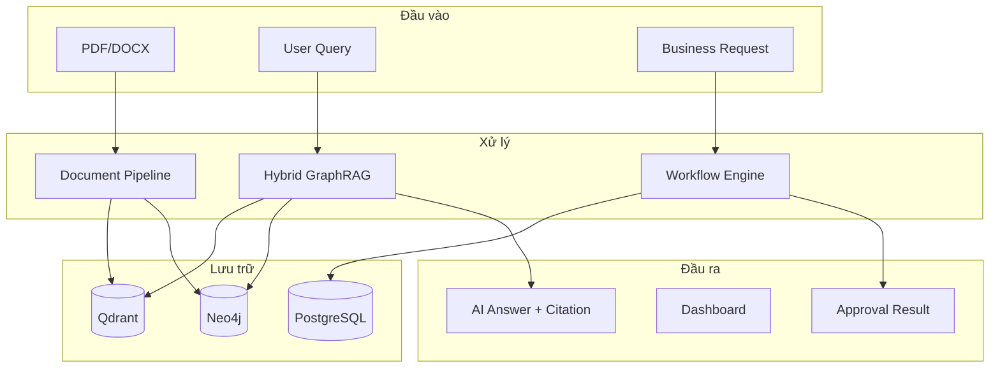

### 1.11. Kết luận chương

Tổng kết bài toán, mục tiêu, phạm vi và giải pháp tổng quan. Dẫn dắt sang Chương 2 (các kỹ thuật AI/DL được sử dụng).

---

## CHƯƠNG 2. CÁC KỸ THUẬT DEEP LEARNING VÀ AI SỬ DỤNG

> **Owner:** Đạt · Thọ đóng góp Document Processing · Đức đóng góp Backend/Architecture

### 2.1. Tổng quan Deep Learning / Generative AI

- Khái niệm Deep Learning
- Neural Network → Transformer Architecture
- Generative AI: Khả năng sinh nội dung mới từ dữ liệu đã học
- Ứng dụng trong xử lý ngôn ngữ tự nhiên (NLP)

### 2.2. Large Language Model (LLM)

- Kiến trúc Transformer (Attention Mechanism)
- Pre-training và Fine-tuning
- Các mô hình phổ biến: GPT-4, Gemini, LLaMA, Mistral
- Hạn chế của LLM thuần túy:
  - Hallucination (bịa thông tin)
  - Không có kiến thức nội bộ doanh nghiệp
  - Không cập nhật theo thời gian thực
- → Cần RAG để giải quyết

### 2.3. Embedding

- Khái niệm: Biến văn bản thành vector số trong không gian đa chiều
- Semantic Similarity: Hai câu có nghĩa giống nhau → vector gần nhau
- Các phương pháp embedding:
  - Word2Vec / GloVe (cổ điển)
  - BERT-based embeddings
  - Sentence Transformers
- Tại sao cần embedding cho RAG:
  - Cho phép tìm kiếm ngữ nghĩa (semantic search) thay vì từ khóa

### 2.4. Mô hình embedding được lựa chọn

- Các ứng viên:
  - `paraphrase-multilingual-MiniLM-L12-v2` (384 dims, hỗ trợ tiếng Việt)
  - `bge-m3` (1024 dims, đa ngôn ngữ)
  - `nomic-embed-text` (768 dims)
  - `text-embedding-3-small` (OpenAI, 1536 dims)
- Tiêu chí lựa chọn: Hỗ trợ tiếng Việt, kích thước vector, tốc độ, RAM/VRAM, chất lượng retrieval
- Bảng so sánh (sẽ bổ sung kết quả thử nghiệm thực tế)

### 2.5. Tokenization

- Khái niệm Token: Đơn vị nhỏ nhất mà LLM xử lý
- Các phương pháp: BPE (Byte Pair Encoding), WordPiece, SentencePiece
- Ảnh hưởng của tokenization đến tiếng Việt:
  - Tiếng Việt có dấu → token count cao hơn tiếng Anh
  - Cần cân nhắc khi thiết kế chunk_size

### 2.6. Các kỹ thuật xử lý tài liệu

#### 2.6.1. Document Parsing

- Trích xuất text từ PDF bằng PyMuPDF
- Phân tách theo trang (Page-level extraction)
- Bảo toàn thông tin trang cho Citation

```python
# Minh họa: Trích xuất theo trang
def extract_text(file_path):
    doc = pymupdf.open(file_path)
    pages_data = []
    for page_num in range(len(doc)):
        page = doc[page_num]
        text = page.get_text()
        pages_data.append({"page": page_num + 1, "text": text})
    return pages_data
```

#### 2.6.2. OCR

- Nhận diện trang scan: Nếu text trích xuất < 50 ký tự → kích hoạt OCR
- Tesseract OCR với ngôn ngữ tiếng Việt (`lang="vie"`)
- Render PDF page thành ảnh trong bộ nhớ (In-memory) → Tesseract → Text
- Xử lý lỗi OCR: Rác sinh học từ mục lục, dấu chấm chấm, ký tự lạ
- Không dùng Regex khổng lồ để sửa rác → Đẩy sang Heuristic của Block Analysis

#### 2.6.3. Block Analysis

- Khái niệm Block: Đơn vị văn bản cơ sở (1 đoạn văn, 1 tiêu đề, 1 mục danh sách)
- Phân loại Block bằng đa tín hiệu (Multi-Signal):
  - **Heading**: Regex + Length Penalty (phạt câu dài > 30 từ để tránh nhận nhầm trích dẫn luật)
  - **Paragraph**: Đoạn văn bản thông thường
  - **List**: Gạch đầu dòng, đánh số (a, b, c)
  - **TOC / Garbage**: Mục lục + Rác OCR (đánh dấu `is_garbage=True`, không xóa)
- Header/Footer Detector: Học theo xác suất lặp lại
- Line Reconstructor: Nối dòng bị đứt gãy do PDF ngắt trang

```python
# Minh họa: Heading Detector với Length Penalty
word_count = len(text.split())
length_score = max(0.0, 1.0 - (word_count / 30.0))

# Câu > 30 từ bắt đầu bằng "Điều" → Trích dẫn luật, KHÔNG phải Heading
if h_type == HeadingType.ARTICLE and word_count > 30:
    length_score = -1.0
```

#### 2.6.4. Dynamic Hierarchy

- Thuật toán Stack (Ngăn xếp) để xây dựng cây phả hệ tài liệu
- Depth detection: Chương = 1, Điều = 2, Khoản = 3
- Dynamic pop: Khi gặp Điều 6 → tự động pop Điều 5 ra khỏi Stack
- Section path: Mỗi node được gán `["Chương II", "Điều 5"]`

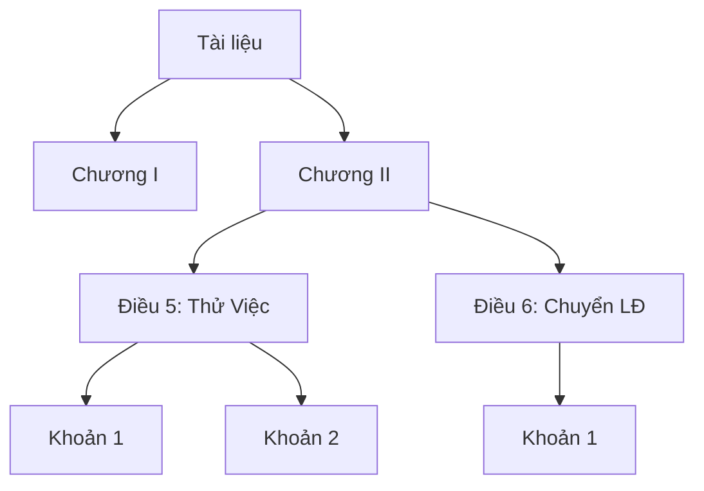

#### 2.6.5. Adaptive Chunking

- Hạn chế của Fixed-size Chunking: Cắt mù phá nát ngữ cảnh
- Giải pháp: Structure-aware Adaptive Chunking với 4 tầng fallback:

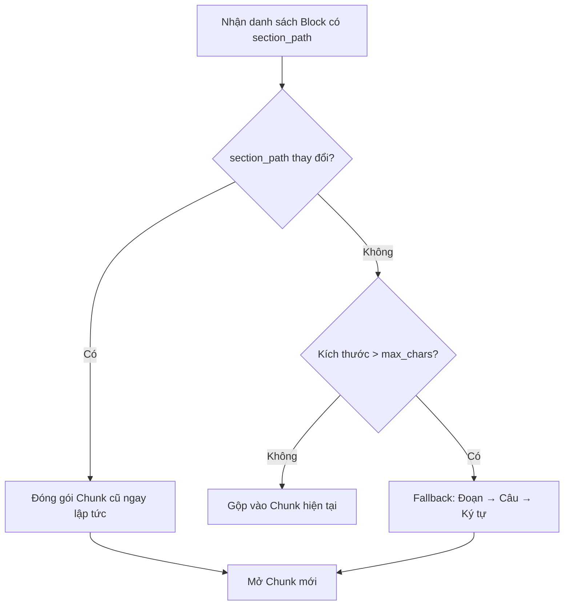

- **Tầng 1 — Structure-aware**: Cắt tại ranh giới section_path (Điều → Điều)
- **Tầng 2 — Paragraph-aware**: Nếu Điều quá dài → cắt tại paragraph
- **Tầng 3 — Sentence-aware**: Nếu paragraph quá dài → cắt tại dấu chấm câu
- **Tầng 4 — Character fallback**: Cắt cứng theo số ký tự (rất hiếm xảy ra)
- Metadata Clone: Chunk con kế thừa 100% metadata từ Chunk cha

### 2.7. Các kỹ thuật AI khác được sử dụng

#### 2.7.1. Entity Extraction

- Trích xuất thực thể từ chunk: Document, Chapter, Article, Department, Role, Policy
- Phương pháp: Rule-based (regex/pattern) + LLM hỗ trợ
- Ví dụ: `"Người lao động thuộc phòng IT..."` → Entity: Employee, Department:IT

#### 2.7.2. Relationship Extraction

- Trích xuất quan hệ giữa các thực thể
- Các loại quan hệ: `CONTAINS`, `REFERENCES`, `APPLIES_TO`, `BELONGS_TO`
- Ví dụ: `Employee ──belongs_to──> Department`

#### 2.7.3. Reranking

- Sau khi retrieval trả về Top-K kết quả → Reranker sắp xếp lại theo mức độ liên quan
- Cross-Encoder: So sánh trực tiếp query với từng chunk (chính xác hơn Bi-Encoder)
- Tăng chất lượng context trước khi đưa vào LLM

#### 2.7.4. Classification / Summarization (nếu có)

- AI phân loại loại yêu cầu IT (Hardware, Software, Network, Account...)
- AI đề xuất mức độ ưu tiên (Low, Medium, High, Critical)
- AI chỉ đề xuất → con người quyết định cuối cùng

### 2.8. Thử nghiệm và lựa chọn mô hình

#### 2.8.1. Tiêu chí đánh giá

| Tiêu chí | Mô tả | Trọng số |
|----------|-------|----------|
| Chất lượng Retrieval | Top-K có chứa chunk liên quan không? | Cao |
| Hỗ trợ tiếng Việt | Embedding hiểu đúng ngữ nghĩa tiếng Việt | Cao |
| Tốc độ Embedding | Thời gian encode 1 batch | Trung bình |
| Kích thước Vector | Ảnh hưởng đến bộ nhớ Qdrant | Trung bình |
| RAM/VRAM yêu cầu | Khả năng chạy trên máy sinh viên | Thấp |

#### 2.8.2. Thiết lập thử nghiệm

- Dataset: Các chunk từ Nội Quy Lao Động + Điều Lệ Công Ty (đã xử lý qua Pipeline M2)
- Bộ câu hỏi test: 20–30 câu hỏi thực tế (VD: "Nhân viên được nghỉ phép bao nhiêu ngày?")
- Phương pháp: Embed cùng dataset → Search cùng bộ câu hỏi → So sánh Top-5

#### 2.8.3. Kết quả

| Mô hình | Dims | Tiếng Việt | Retrieval Quality | Tốc độ | RAM |
|---------|------|-----------|-------------------|--------|-----|
| MiniLM-L12 multilingual | 384 | Tốt | ... | ... | ... |
| BGE-M3 | 1024 | Rất tốt | ... | ... | ... |
| Nomic Embed | 768 | Khá | ... | ... | ... |
| OpenAI text-embedding-3 | 1536 | Rất tốt | ... | ... | ... |

*(Bảng sẽ được điền kết quả thực nghiệm)*

#### 2.8.4. Lựa chọn mô hình cuối cùng

- Mô hình được chọn và lý do
- Trade-off giữa chất lượng và tài nguyên

### 2.9. Kết luận chương

Tổng kết các kỹ thuật AI/DL được sử dụng trong đồ án, kết quả lựa chọn mô hình. Dẫn dắt sang Chương 3 (Knowledge Graph và RAG).

---

## CHƯƠNG 3. KNOWLEDGE GRAPH VÀ RAG

> **Owner:** Đạt · Thọ đóng góp Retrieval/Citation · Đức đóng góp Integration

### 3.1. Tổng quan RAG

- Retrieval-Augmented Generation: Kết hợp truy xuất (Retrieval) với sinh (Generation)
- Tại sao cần RAG:
  - LLM không có kiến thức nội bộ doanh nghiệp
  - LLM có thể bịa thông tin (Hallucination)
  - RAG cung cấp context chính xác từ tài liệu thật → LLM trả lời dựa trên bằng chứng

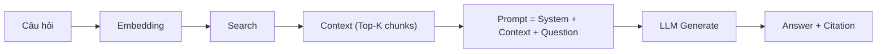

### 3.2. Vector Database

- Khái niệm: Lưu trữ và tìm kiếm vector embedding hiệu quả
- Các giải pháp: Qdrant, Pinecone, Weaviate, Milvus, ChromaDB
- **Qdrant được chọn** vì: Open-source, REST API, filtering mạnh, Docker-ready
- Kiến trúc Qdrant: Collection → Point (Vector + Payload)
- Distance metric: Cosine Similarity

### 3.3. Vector Retrieval

- Query embedding: Biến câu hỏi thành vector
- Similarity search: Tìm Top-K chunk gần nhất trong không gian vector
- Metadata filtering: Lọc theo `document_type`, `version_id`, `access_level`
- Current version filtering: Chỉ trả về chunk từ phiên bản tài liệu hiện hành

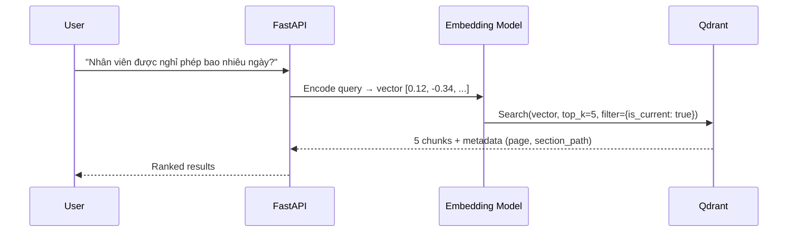

### 3.4. Knowledge Graph

- Khái niệm: Biểu diễn tri thức dưới dạng đồ thị (Node + Edge)
- Node: Thực thể (Document, Chapter, Article, Department, Employee)
- Edge: Quan hệ (CONTAINS, REFERENCES, APPLIES_TO, BELONGS_TO)
- Ưu điểm so với Vector Search:
  - Truy vấn theo cấu trúc: "Điều 5 thuộc Chương nào?"
  - Truy vấn quan hệ: "Các Điều liên quan đến nghỉ phép?"
  - Hỗ trợ câu hỏi vĩ mô (Global Query)

### 3.5. Graph Database

- **Neo4j được chọn** vì: Mature, Cypher query language, Community Edition miễn phí
- Node properties: name, type, content, page, source
- Relationship properties: weight, type

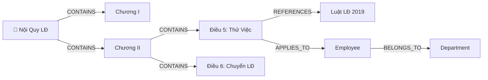

### 3.6. Entity và Relationship

**Entity types:**

| Entity | Nguồn | Ví dụ |
|--------|-------|-------|
| Document | Metadata Enrichment | "Nội Quy Lao Động" |
| Chapter | section_path[0] | "Chương II - Hợp Đồng LĐ" |
| Article | section_path[1] | "Điều 5: Thử Việc" |
| Department | Entity Extraction | "Phòng IT", "Phòng Nhân sự" |
| Policy | Entity Extraction | "Chính sách nghỉ phép" |

**Relationship types:**

| Relationship | Từ → Đến | Ví dụ |
|-------------|----------|-------|
| CONTAINS | Document → Chapter | Nội Quy LĐ → Chương II |
| CONTAINS | Chapter → Article | Chương II → Điều 5 |
| REFERENCES | Article → Law | Điều 5 → Luật LĐ 2019 |
| APPLIES_TO | Article → Role | Điều 5 → Employee |
| BELONGS_TO | Employee → Department | Nguyễn Văn A → Phòng IT |

### 3.7. Graph Retrieval

- Cypher query: Truy vấn đồ thị theo cấu trúc
- Ví dụ: `MATCH (d:Article)-[:APPLIES_TO]->(r:Role {name: 'Employee'}) RETURN d`
- Kết hợp với keyword extraction từ câu hỏi user

### 3.8. GraphRAG

- Microsoft GraphRAG: Community detection → Summary → Global Search
- Ứng dụng: Câu hỏi tổng hợp cần nhiều nguồn ("Tóm tắt các quy định về nghỉ phép")
- Khác biệt với Naive RAG: Không chỉ tìm chunk giống nhất, mà còn tìm chunk có quan hệ

### 3.9. Hybrid Retrieval

#### 3.9.1. Vector Search
- Tìm kiếm ngữ nghĩa (Semantic): Câu hỏi → Vector → Qdrant → Top-K

#### 3.9.2. Graph Search
- Tìm kiếm cấu trúc (Structural): Câu hỏi → Entity → Neo4j → Related Nodes

#### 3.9.3. Fusion
- Kết hợp kết quả từ Vector Search và Graph Search
- Reciprocal Rank Fusion (RRF) hoặc Weighted Fusion

#### 3.9.4. Reranking
- Cross-Encoder rerank kết quả fusion
- Chọn Top-K cuối cùng làm context cho LLM

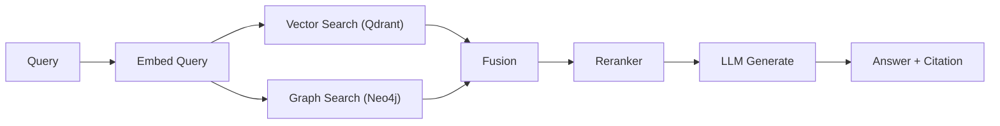

### 3.10. Quy trình sinh câu trả lời

- System Prompt: Hướng dẫn LLM vai trò, phong cách, giới hạn
- Context injection: Đưa Top-K chunks vào prompt
- Instruction: "Trả lời dựa trên context. Nếu không có thông tin → nói không biết."
- Output format: Answer + Source (Tài liệu, Trang, Điều/Khoản)

### 3.11. Citation và truy xuất nguồn

- Mỗi chunk mang metadata: `document_id`, `page_start`, `page_end`, `section_path`
- LLM được yêu cầu trích dẫn nguồn kèm câu trả lời
- UI hiển thị:
  ```
  📄 Nguồn: Nội Quy Lao Động
  📃 Trang: 7
  📌 Điều 5: Thử Việc
  ```

### 3.12. Thử nghiệm và đánh giá RAG

#### 3.12.1. Dataset thử nghiệm
- Tài liệu: Nội Quy Lao Động, Điều Lệ Công Ty, Quy Chế Quản Trị
- Bộ câu hỏi: 30–50 câu hỏi thực tế (chia theo loại: factual, summary, relational)

#### 3.12.2. Retrieval evaluation

| Metric | Mô tả |
|--------|-------|
| Precision@K | Tỷ lệ chunk liên quan trong Top-K |
| Recall@K | Tỷ lệ chunk liên quan được tìm thấy |
| MRR | Mean Reciprocal Rank — vị trí chunk đúng đầu tiên |

#### 3.12.3. Answer quality

| Metric | Mô tả |
|--------|-------|
| Correctness | Câu trả lời có đúng không? (Human evaluation) |
| Faithfulness | Câu trả lời có bám sát context không? (Giảm hallucination) |
| Relevance | Câu trả lời có liên quan đến câu hỏi không? |

#### 3.12.4. Citation accuracy
- Nguồn trích dẫn có đúng tài liệu/trang/điều không?
- Tỷ lệ citation chính xác

#### 3.12.5. So sánh Vector RAG và GraphRAG

| Phương pháp | Retrieval Quality | Answer Quality | Citation | Tốc độ |
|-------------|-------------------|----------------|----------|--------|
| Vector RAG (Qdrant only) | ... | ... | ... | ... |
| Graph RAG (Neo4j only) | ... | ... | ... | ... |
| Hybrid GraphRAG | ... | ... | ... | ... |

*(Bảng sẽ được điền kết quả thực nghiệm)*

### 3.13. Kết luận chương

Tổng kết kiến trúc RAG/GraphRAG, kết quả so sánh. Dẫn dắt sang Chương 4 (Thiết kế hệ thống).

---

## CHƯƠNG 4. THIẾT KẾ HỆ THỐNG VÀ PIPELINE

> **Owner:** Đức · Thọ đóng góp AI Pipeline · Đạt đóng góp RAG Pipeline

### 4.1. Kiến trúc tổng thể

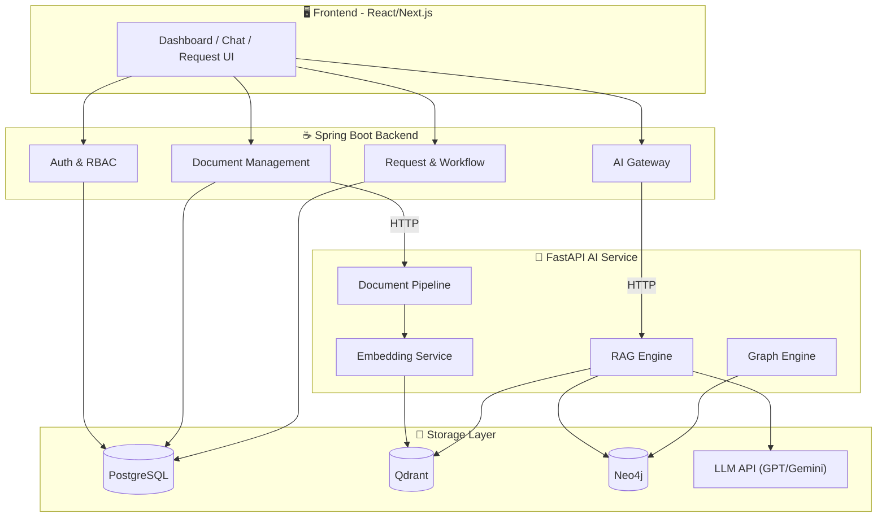

### 4.2. Kiến trúc các service

#### 4.2.1. Frontend
- Framework: React / Next.js
- State management: React Context / Zustand
- Các trang chính: Login, Dashboard, Documents, AI Chat, Requests

#### 4.2.2. Spring Boot Backend
- Java 17+, Spring Boot 3.x
- Spring Security + JWT
- Spring Data JPA + PostgreSQL
- REST API

#### 4.2.3. AI Service
- Python 3.12, FastAPI
- Endpoints: `/api/v1/chat`, `/api/v1/search`, `/api/v1/process`
- Modules: Document Pipeline, Embedding, RAG, Graph

#### 4.2.4. PostgreSQL
- Lưu trữ: Users, Roles, Documents, Versions, Requests, Approvals

#### 4.2.5. Qdrant
- Lưu trữ: Vector embeddings + metadata payload
- Collection: `enterprise_documents`

#### 4.2.6. Neo4j
- Lưu trữ: Knowledge Graph (Document → Chapter → Article → Entity)

### 4.3. Thiết kế cơ sở dữ liệu

#### 4.3.1. ERD

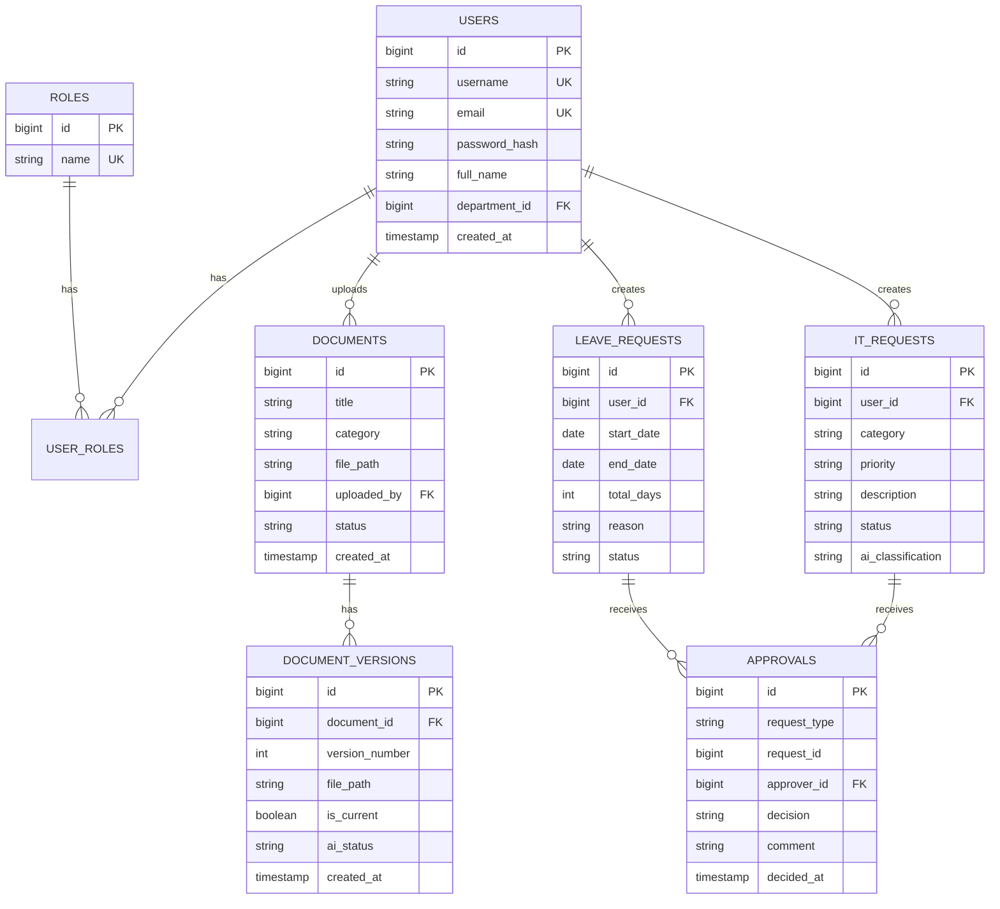

#### 4.3.2. Thiết kế các bảng
- Chi tiết từng bảng: Tên cột, kiểu dữ liệu, constraint, index

### 4.4. Thiết kế module

#### 4.4.1. Authentication / Authorization
- Register → Hash password → Save to DB
- Login → Validate → Generate JWT → Return token
- Mỗi request → JWT Filter → Extract role → Authorize

#### 4.4.2. Document Management
- Upload PDF → Save file → Create Document + Version record
- Trigger AI Processing Pipeline (async)
- CRUD: List, Detail, Update, Delete, Version history

#### 4.4.3. Knowledge Management
- Embedding + Qdrant upsert
- Entity Extraction + Neo4j upsert
- Version management: Khi upload version mới → đánh dấu version cũ `is_current=false`

#### 4.4.4. AI Assistant
- Chat endpoint: Query → RAG → Answer + Citation
- Search endpoint: Query → Vector/Graph search → Results
- Lịch sử chat (optional)

#### 4.4.5. Leave Request
- Employee tạo đơn → Submit → Manager duyệt → Approve/Reject
- Tính số ngày nghỉ tự động
- Comment trên đơn

#### 4.4.6. IT Request
- Employee tạo yêu cầu → AI phân loại + đề xuất priority → IT Support xử lý → Resolve
- AI chỉ đề xuất, IT Support quyết định cuối cùng

### 4.5. Thiết kế xử lý tài liệu (Document Processing Pipeline)

```mermaid
graph LR
    A[PDF] -->|Bước 1| B[Parser]
    B -->|01_extracted_pages.json| C[Block Analyzer]
    C -->|02_analyzed_nodes.json| D[Hierarchy Resolver]
    D -->|03_structured_nodes.json| E[Adaptive Chunker]
    E -->|04_extracted_chunks.json| F[Metadata Enricher]
    F -->|05_enriched_chunks.json| G[Embedding + Qdrant]
```

#### 4.5.1. Parser
- Input: PDF file path
- Output: List[{page, text}]
- Xử lý: PyMuPDF extraction + OCR fallback

#### 4.5.2. OCR
- Input: Page image (khi text < 50 chars)
- Output: OCR text + confidence
- Xử lý: Tesseract tiếng Việt

#### 4.5.3. Block Analysis
- Input: Raw pages
- Output: List of typed blocks (HEADING, PARAGRAPH, LIST, TOC)
- Xử lý: HeadingDetector + GarbageDetector + LineReconstructor

#### 4.5.4. Dynamic Hierarchy
- Input: Typed blocks
- Output: Blocks with section_path
- Xử lý: Stack-based hierarchy resolution

#### 4.5.5. Adaptive Chunking
- Input: Structured blocks
- Output: Chunks with metadata
- Xử lý: 4-tier fallback (Section → Paragraph → Sentence → Character)

#### 4.5.6. Metadata Enrichment
- Input: Raw chunks
- Output: Enriched chunks with business metadata
- Xử lý: Rule-based (document_id, version_id, RBAC fields)

### 4.6. Pipeline xây dựng Knowledge Base

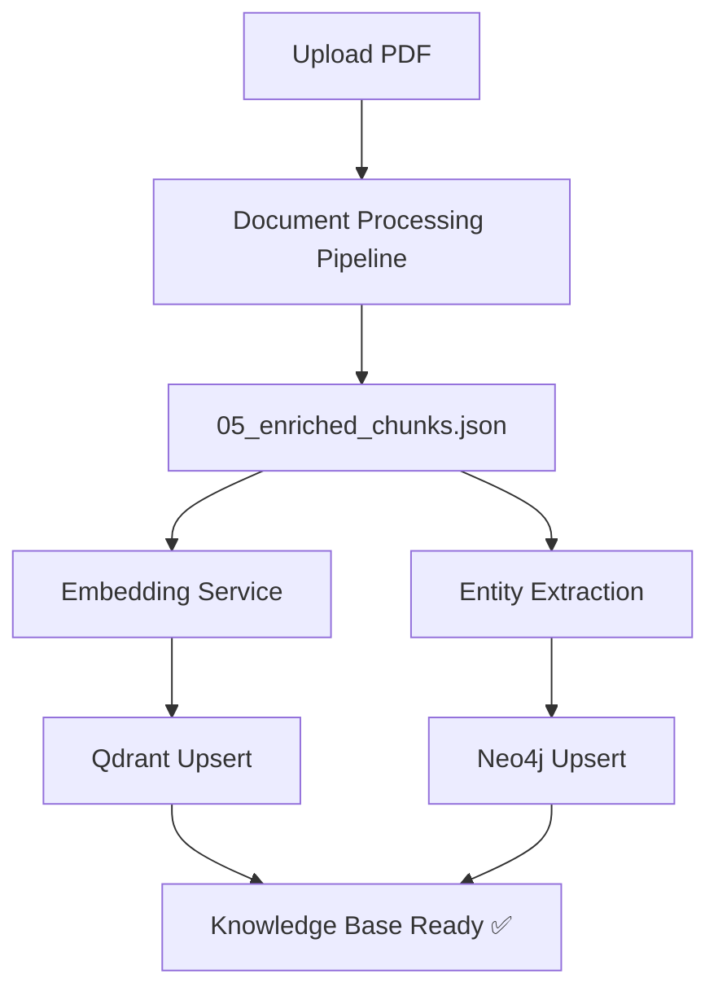

### 4.7. Pipeline RAG / GraphRAG

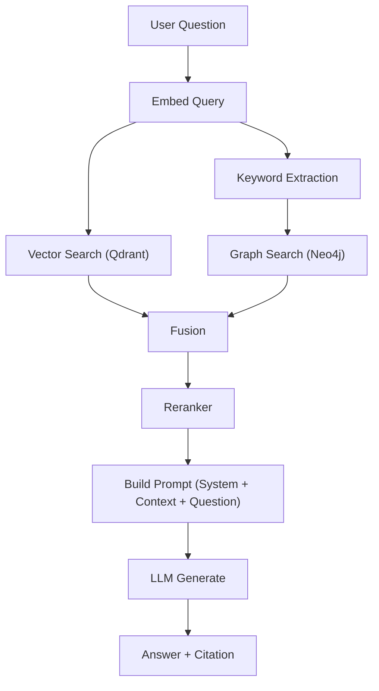

### 4.8. Pipeline xử lý yêu cầu nghiệp vụ

**Leave Request Workflow:**
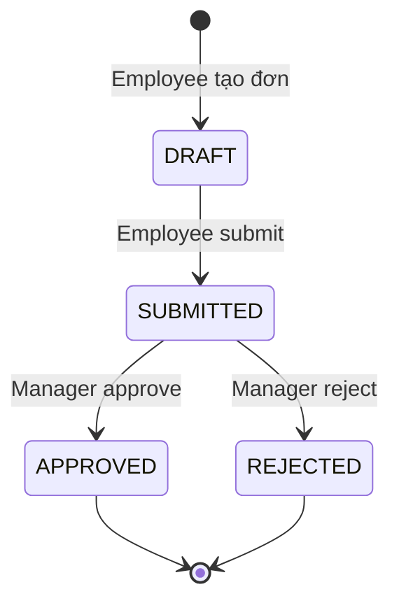

**IT Request Workflow:**
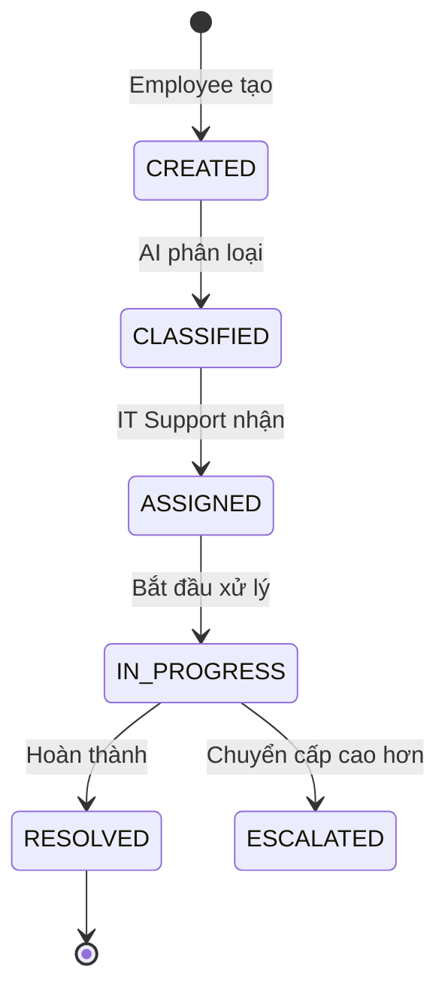

### 4.9. Use Case Diagram

*(Vẽ bằng draw.io hoặc PlantUML, nhúng ảnh vào báo cáo)*

### 4.10. Activity Diagram

*(Vẽ cho các luồng chính: Upload Document, AI Chat, Leave Request)*

### 4.11. Sequence Diagram

*(Vẽ cho: Login, Upload + Processing, RAG Chat, Leave Approval)*

### 4.12. Package / Component Diagram

```text
enterprise-ai-platform/
├── frontend/           (React/Next.js)
├── backend/            (Spring Boot)
│   ├── auth/
│   ├── user/
│   ├── document/
│   ├── request/
│   └── ai-gateway/
├── ai-service/         (FastAPI)
│   ├── app/
│   │   ├── document_parser.py
│   │   ├── block_analyzer.py
│   │   ├── structure_analyzer.py
│   │   ├── adaptive_chunker.py
│   │   ├── metadata_enricher.py
│   │   ├── embedding_service.py
│   │   ├── qdrant_service.py
│   │   ├── rag_engine.py
│   │   └── graph_engine.py
│   ├── scripts/
│   ├── tests/
│   └── docs/
└── docker-compose.yml
```

### 4.13. Deployment Architecture

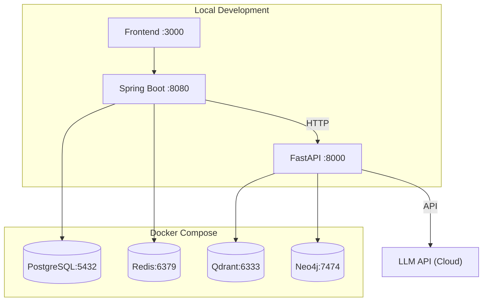

### 4.14. Kết luận chương

Tổng kết thiết kế hệ thống, các pipeline, các diagram. Dẫn dắt sang Chương 5 (Triển khai và Demo).

---

## CHƯƠNG 5. TRIỂN KHAI, THỰC NGHIỆM VÀ KẾT QUẢ DEMO

> **Owner:** Cả 3

### 5.1. Môi trường triển khai

| Thành phần | Phiên bản |
|-----------|-----------|
| OS | Windows 11 |
| Python | 3.12 |
| Java | 17+ |
| Node.js | 18+ |
| Docker | 24+ |
| PostgreSQL | 15 |
| Qdrant | latest |
| Neo4j | 5.x |
| Redis | 7 |

### 5.2. Công nghệ sử dụng

| Layer | Công nghệ |
|-------|----------|
| Frontend | React / Next.js, TailwindCSS |
| Backend | Spring Boot 3.x, Spring Security, Spring Data JPA |
| AI Service | FastAPI, PyMuPDF, Tesseract, Sentence-Transformers |
| Vector DB | Qdrant |
| Graph DB | Neo4j |
| RDBMS | PostgreSQL |
| Cache | Redis |
| LLM | OpenAI GPT / Google Gemini |
| Container | Docker Compose |

### 5.3. Triển khai hệ thống

#### 5.3.1. Docker
- `docker-compose up -d` khởi động PostgreSQL, Qdrant, Redis
- Neo4j (nếu dùng Docker hoặc Desktop)

#### 5.3.2–5.3.6. Các service
- Hướng dẫn cài đặt, cấu hình, chạy từng service

### 5.4. Kịch bản kiểm thử

| # | Kịch bản | Mô tả | Kết quả mong đợi |
|---|----------|-------|-------------------|
| TC01 | Upload PDF | Upload Nội Quy LĐ → Pipeline xử lý | 05_enriched_chunks.json sinh ra |
| TC02 | Hỏi AI factual | "Nhân viên được nghỉ phép bao nhiêu ngày?" | Trả lời đúng + Citation |
| TC03 | Hỏi AI relational | "Các quy định liên quan đến Điều 5?" | Graph search trả về đúng |
| TC04 | Leave Request | Employee tạo đơn → Manager duyệt | Status chuyển APPROVED |
| TC05 | IT Request | Employee tạo → AI phân loại → IT resolve | Phân loại đúng category |
| TC06 | RBAC | Employee không xem được tài liệu restricted | Access denied |

### 5.5. Kết quả xử lý tài liệu

- Screenshot/Bảng kết quả Pipeline trên các tài liệu thực tế
- Số chunk, chất lượng section_path, tỷ lệ garbage filtered

| Tài liệu | Trang | Chunks | Garbage filtered | Heading accuracy |
|-----------|-------|--------|-----------------|------------------|
| Nội Quy Lao Động | 15 | ~60 | ... | ... |
| Điều Lệ Công Ty 2021 | 38 | ~140 | ... | ... |
| Quy Chế Quản Trị | ... | ... | ... | ... |

### 5.6. Kết quả RAG / GraphRAG

| Câu hỏi | Vector RAG | GraphRAG | Hybrid |
|---------|-----------|----------|--------|
| Factual | ... | ... | ... |
| Relational | ... | ... | ... |
| Summary | ... | ... | ... |

### 5.7. Kết quả các chức năng nghiệp vụ

- Screenshot các màn hình: Login, Dashboard, Document List, AI Chat, Leave Request, IT Request
- Mô tả luồng thao tác từng chức năng

### 5.8. Đánh giá hệ thống

#### 5.8.1. Độ chính xác
- Document Processing accuracy
- Heading detection accuracy
- Chunk boundary accuracy

#### 5.8.2. Chất lượng truy xuất
- Precision@5, Recall@5, MRR

#### 5.8.3. Chất lượng câu trả lời
- Correctness, Faithfulness, Relevance (Human evaluation)

#### 5.8.4. Citation
- Citation accuracy rate

#### 5.8.5. Thời gian phản hồi
- Pipeline processing time
- RAG response time
- End-to-end response time

### 5.9. Demo hệ thống

- Video demo hoặc kịch bản demo trực tiếp
- Các luồng chính cần demo:
  1. Admin upload tài liệu → Pipeline xử lý tự động
  2. Employee hỏi AI → Trả lời + Citation
  3. Employee tạo đơn nghỉ phép → Manager duyệt
  4. Employee tạo yêu cầu IT → AI phân loại → IT xử lý

### 5.10. Hạn chế

- OCR: Chất lượng phụ thuộc vào chất lượng scan
- Bảng biểu phức tạp: Chưa xử lý được table detection
- LLM: Phụ thuộc vào API bên ngoài (cost, latency, privacy)
- Đa ngôn ngữ: Chỉ hỗ trợ tiếng Việt

### 5.11. Kết luận chương

Tổng kết kết quả triển khai, đánh giá, hạn chế.

---

## KẾT LUẬN

### Kết quả đạt được
- Xây dựng thành công Document Processing Pipeline 5 bước
- Xây dựng thành công hệ thống Hybrid GraphRAG
- Xây dựng thành công Backend nghiệp vụ với RBAC
- Xây dựng thành công giao diện người dùng

### Những đóng góp của đề tài
- Adaptive Chunking: Giải quyết bài toán chia văn bản tiếng Việt theo cấu trúc ngữ nghĩa
- Hybrid GraphRAG: Kết hợp Vector + Graph cho chất lượng retrieval vượt trội
- Lossless Pipeline: Kiến trúc pipeline bảo toàn dữ liệu, dễ debug và mở rộng

### Hạn chế
- Chưa hỗ trợ đa ngôn ngữ
- Chưa xử lý bảng biểu phức tạp
- Phụ thuộc LLM API bên ngoài

### Hướng phát triển
- Tích hợp On-premise LLM (LLaMA, Mistral) để giảm phụ thuộc Cloud
- Mở rộng xử lý bảng biểu, hình ảnh trong tài liệu
- Community Detection trên Knowledge Graph cho Global Search
- Mobile App
- Multi-tenant cho nhiều doanh nghiệp

---

## TÀI LIỆU THAM KHẢO

*(Sẽ bổ sung theo chuẩn IEEE/APA)*

---

## PHỤ LỤC

- Phụ lục A: Mã nguồn các module chính
- Phụ lục B: Bộ câu hỏi thử nghiệm
- Phụ lục C: Kết quả thử nghiệm chi tiết
- Phụ lục D: Hướng dẫn cài đặt và triển khai
