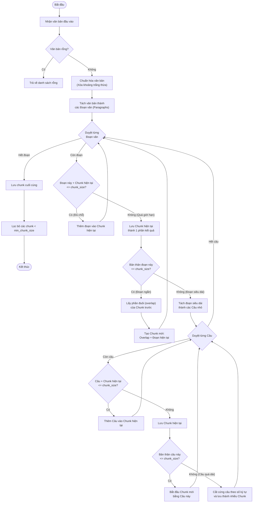

# Giải thích quy trình Chunking (Chia nhỏ văn bản)

Quá trình chia nhỏ văn bản (Chunking) trong class `TextChunker` được thiết kế để cắt một văn bản dài thành các đoạn nhỏ (chunks) sao cho máy tính (hoặc AI) dễ dàng xử lý, nhưng vẫn **giữ nguyên được ngữ cảnh** bằng cách không cắt ngang câu và có đoạn gối đầu (overlap) giữa các chunk.

Dưới đây là sơ đồ luồng hoạt động (Flowchart) và mô tả chi tiết từng bước.

## 1. Sơ đồ luồng hoạt động (Flowchart)

---

## 2. Mô tả chi tiết từng bước

Thuật toán `split_text` hoạt động theo nguyên tắc **"Từ Lớn đến Nhỏ"**: Cố gắng gộp theo Đoạn văn -> Nếu đoạn quá to thì cắt theo Câu -> Nếu câu vẫn quá to thì cắt cứng theo Ký tự.

### Bước 1: Tiền xử lý (Pre-processing)

- **Chuẩn hóa (`_normalize_text`)**: Xóa các khoảng trắng dư thừa, biến các chuỗi dòng trống dài thành dấu ngắt đoạn chuẩn (`\n\n`).
- **Tách đoạn (`_split_into_paragraphs`)**: Cắt văn bản ban đầu thành một danh sách các đoạn văn dựa trên dấu xuống dòng đôi (`\n\n`).

### Bước 2: Duyệt và Gộp các đoạn văn (Paragraph processing)

Hệ thống sẽ lấy từng đoạn văn và cố gắng "nhét" nó vào "Chunk hiện tại" (ban đầu rỗng).

- **Trường hợp lý tưởng**: Nếu gộp thêm đoạn này mà tổng số ký tự vẫn nhỏ hơn giới hạn `chunk_size` (1200 ký tự), nó sẽ tiếp tục gộp đoạn tiếp theo.
- **Trường hợp tràn giới hạn**: Nếu gộp vào mà vượt quá `chunk_size`, hệ thống sẽ "chốt sổ" và lưu Chunk hiện tại vào danh sách kết quả.

### Bước 3: Xử lý phần gối đầu (Overlap) khi sang Chunk mới

Khi một Chunk đã đầy và phải tạo Chunk mới, để AI không bị mất ngữ cảnh giữa 2 Chunk, hệ thống sẽ gọi hàm `_get_overlap`.

- Nó sẽ copy một số ký tự cuối cùng của Chunk cũ (dựa theo `chunk_overlap = 200`).
- Chunk mới sẽ được khởi tạo bằng: **[Đoạn Overlap] + [Đoạn văn tiếp theo]**.

### Bước 4: Xử lý Đoạn văn siêu dài (Long text processing)

Sẽ có những đoạn văn dài miên man, bản thân một đoạn văn đã lớn hơn `chunk_size` (hơn 1200 ký tự).

- Lúc này, hàm `_split_long_text` sẽ nhảy vào can thiệp.
- Nó cắt đoạn văn đó ra thành **từng câu** dựa trên các dấu chấm câu (`.`, `!`, `?`).
- Sau đó, nó áp dụng thuật toán gộp tương tự như Bước 2 nhưng là **gộp từng câu**.
- Nếu có một "câu" nào đó viết sai ngữ pháp, dài hơn cả `chunk_size` mà không có dấu chấm, hệ thống buộc phải "cắt cứng" (hard cut) theo đúng số ký tự giới hạn để đảm bảo không có chunk nào vượt quá 1200.

### Bước 5: Chốt sổ và Lọc kết quả (Finalize)

- Khi đã duyệt hết văn bản, nếu còn thừa đoạn chữ nào đang lắp ghép dở, hệ thống sẽ lưu nốt thành chunk cuối cùng.
- Cuối cùng, hệ thống lọc bỏ đi những chunk quá ngắn (nhỏ hơn `min_chunk_size = 100` ký tự) vì những mảnh vụn này thường không có nhiều ý nghĩa ngữ cảnh.

---

## 3. Ví dụ minh họa

Giả sử `chunk_size = 100` và `chunk_overlap = 20`:

> **Văn bản gốc:**
> _"Đây là đoạn một. Độ dài vừa phải."_
> _"Đây là đoạn hai, nó chứa nội dung rất quan trọng về AI và tương lai."_
> _"Đoạn ba là kết luận."_

- **Chunk 1**: `"Đây là đoạn một. Độ dài vừa phải."` (Chunk đầy)
- **Chunk 2**: `"Độ dài vừa phải. Đây là đoạn hai, nó chứa nội dung rất quan trọng về AI và tương lai."` *(Lưu ý câu "Độ dài vừa phải." là phần overlap được kéo từ Chunk 1 sang).*
- **Chunk 3**: `"về AI và tương lai. Đoạn ba là kết luận."` *(Phần đầu là overlap từ Chunk 2).*
